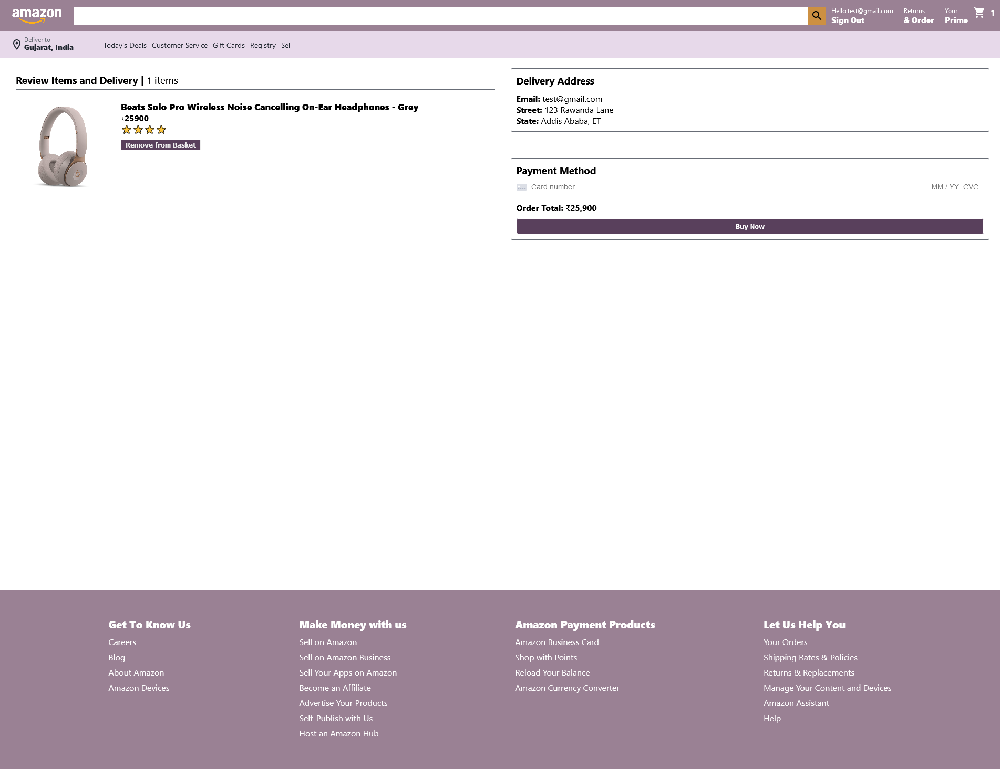
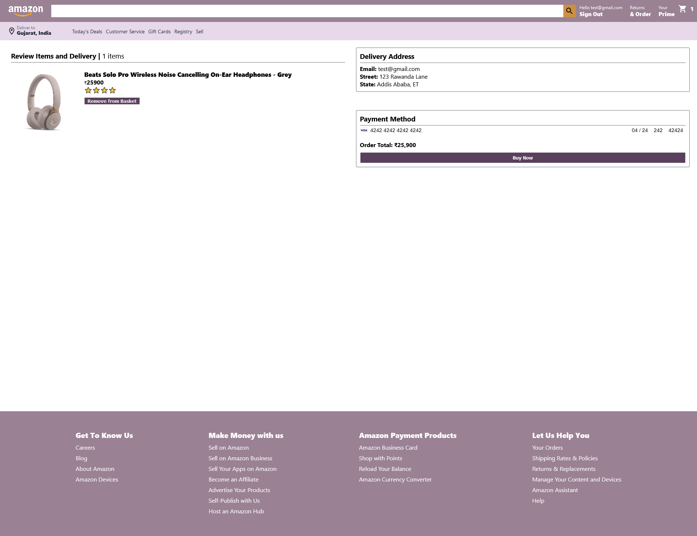
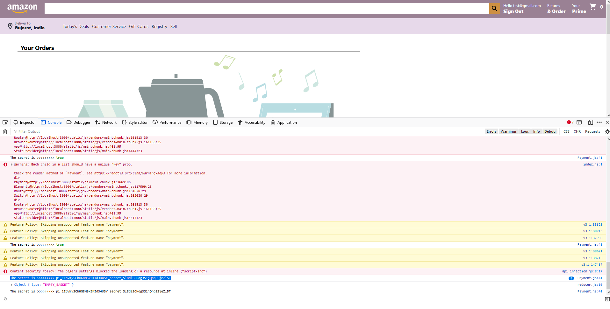
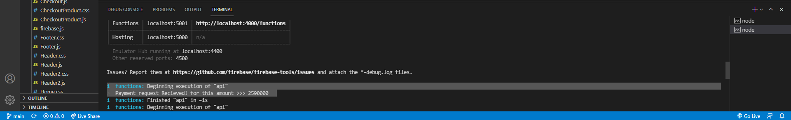
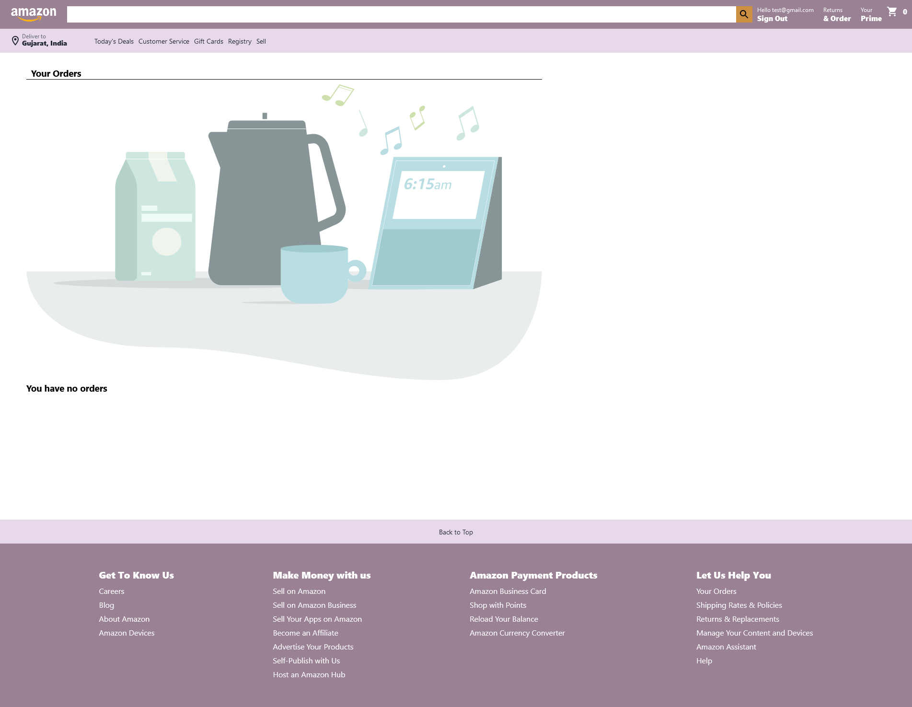
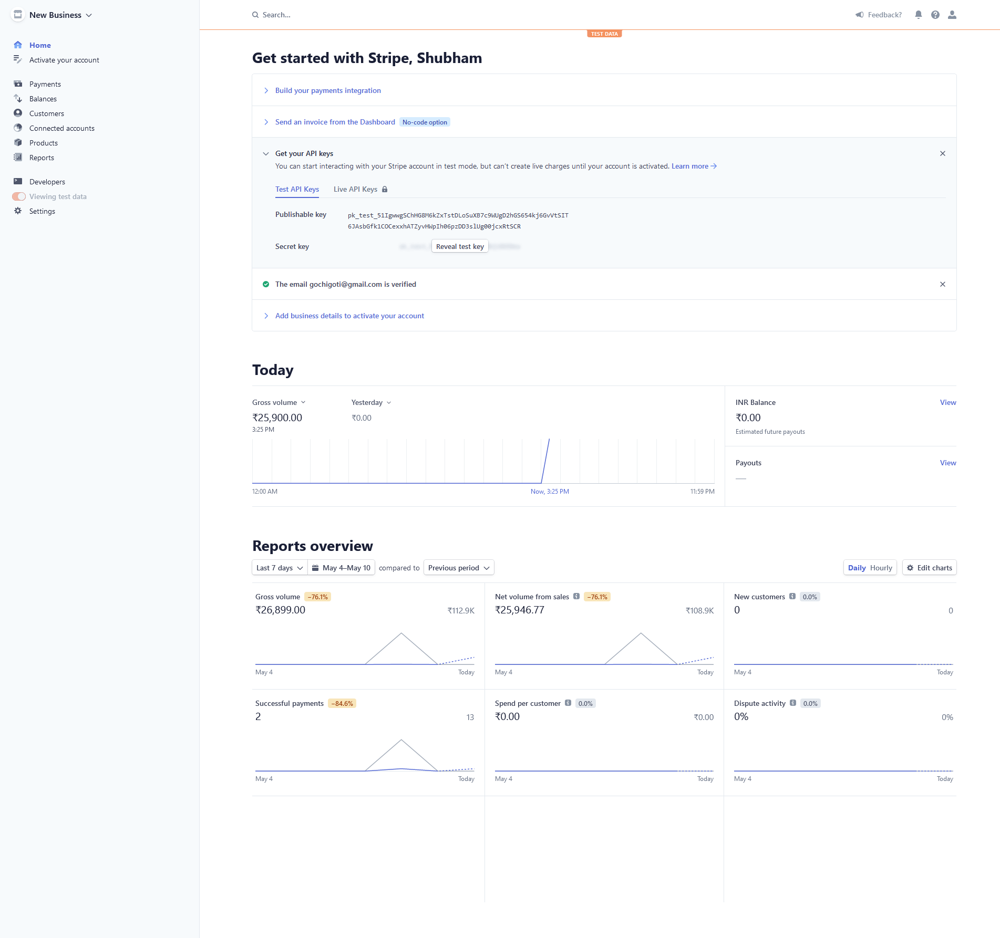
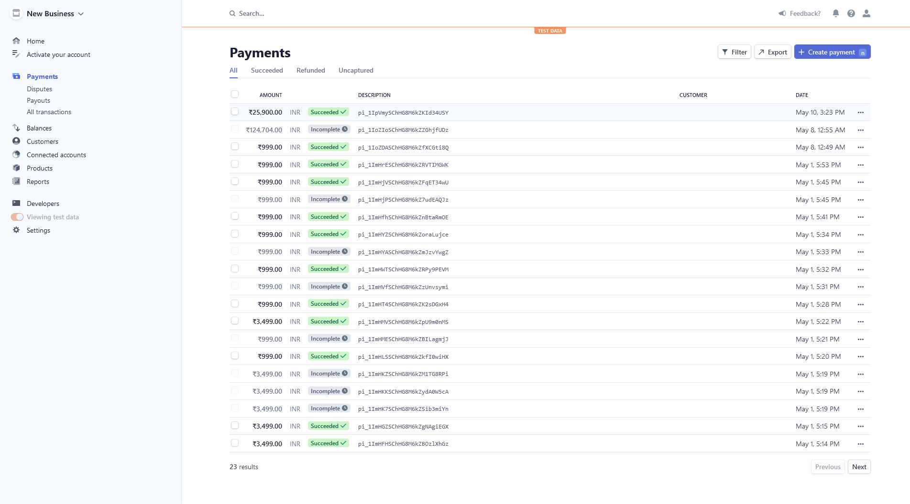

# fly-buy
 e-commerce website using React, Firebase, and Stripe payment API. 

## Homepage
The home page is simple which contains products which can be added to the basket once added the counter in the header(Basket) will increase.

## Loginpage
The login page is has two option signup and login. I have used Firebase auth for the login and signup.

## Subtotal
After adding our Beats Headphone to the basket it will be displayed in the subtotal along with the total. You can remove your item product if you want proceeding further.

## Order
In order you can review your items and delivery. Delivery address along with payment method is given.

You can enter the test card number provided by stripe in the card number.

Before clicking on buy now it will process and backend will generate a secret key in the console. The seceret key will be unique and will change when items in the basket are changed.

Inside my vscode terminal the request along with successful payment is displayed

## Orders (After Payment)
After the payment is successful it will take you to the orders page showing you do not have any futher orders.

## Stripe
After the payment of the Beats Headphone went through, my stripe page will display the amount that is recieved.

You can see inside stripe payments the last entry[may 10th], the payment of the beats headphone [₹25,900] is recieved.

