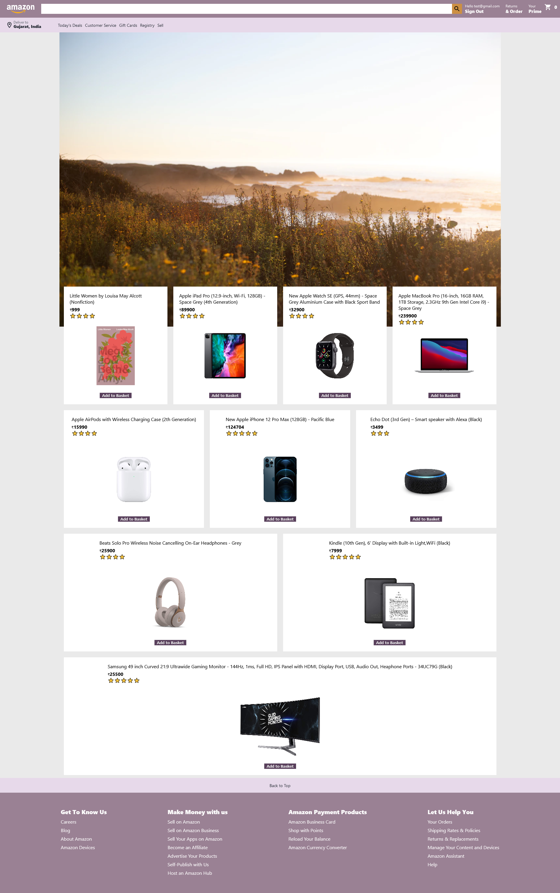
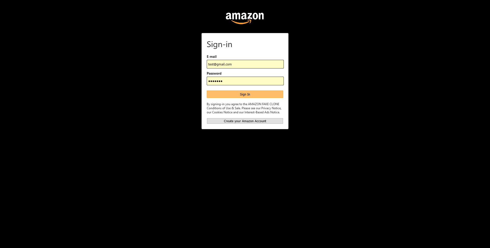
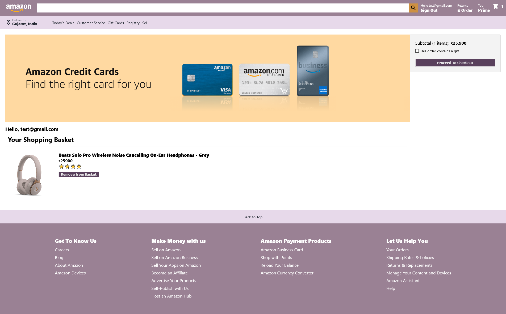

# fly-buy
 e-commerce website using React, Firebase, and Stripe payment API. 

## Homepage
The home page is simple which contains products which can be added to the basket once added the counter in the header(Basket) will increase.

## Loginpage
The login page is has two option signup and login. I have used Firebase auth for the login and signup.

## Subtotal
After adding our Beats Headphone to the basket it will be displayed in the subtotal along with the total. You can remove your item product if you want proceeding further.

